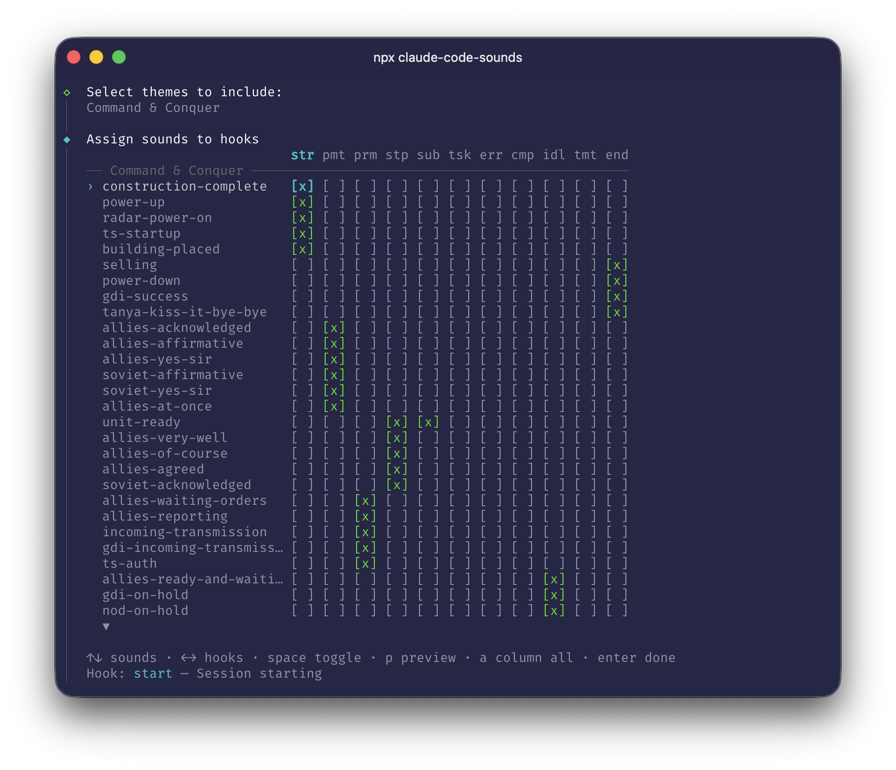

<div align="center">


# claude-code-sounds

[](https://www.npmjs.com/package/claude-code-sounds)

**Sound themes for [Claude Code](https://docs.anthropic.com/en/docs/claude-code) lifecycle hooks.**

Plays sound effects when sessions start, prompts are submitted, responses finish, errors occur, and more.

Ships with 15 themes. Bring your own sounds or create new ones.

*"Something need doing?"*

</div>

## Quick Start

```bash
npx claude-code-sounds
```

The interactive installer checks dependencies, lets you pick a theme, and optionally customize which sounds map to each hook — all in the terminal.

Requires macOS (uses `afplay`) and Node.js 20+.

<details>
<summary>Alternative: install from source</summary>

```bash
git clone https://github.com/ryparker/claude-code-sounds.git
cd claude-code-sounds
./install.sh
```

The bash installer requires `jq` (`brew install jq`).

</details>

## Themes

| Theme | Sounds | Vibe |
|---|---|---|
| **Age of Empires 2** (`aoe2`) | 48 | *"Wololo!"* — Villager taunts, monks, and age advance fanfares |
| **Call of Duty** (`cod`) | 38 | *"Enemy AC-130 above!"* — Killstreaks, hitmarkers, and Captain Price |
| **Command & Conquer** (`cnc`) | 52 | *"Construction complete"* — EVA announcements, unit voices, and Red Alert |
| **Diablo 2** (`diablo2`) | 46 | *"Stay awhile and listen"* — Deckard Cain, item drops, and the Prime Evils |
| **Halo** (`halo`) | 52 | *"Wake me when you need me"* — Master Chief, Cortana, and the multiplayer announcer |
| **Metal Gear Solid** (`mgs`) | 40 | *"Kept you waiting, huh?"* — Codec calls, alert sounds, and Snake |
| **Pokemon Gen 3** (`pokemon-gen3`) | 51 | *"A wild TREECKO appeared!"* — GBA battle cries, Hoenn fanfares, and RSE bleeps |
| **Portal** (`portal`) | 42 | *"Are you still there?"* — Turrets, portal guns, and Aperture Science |
| **Short Circuit** (`short-circuit`) | 41 | *"Number 5 is alive!"* — The lovable sentient robot from the 1986 classic |
| **Star Wars** (`star-wars`) | 36 | *"May the Force be with you"* — Lightsabers, R2-D2, and the dark side |
| **StarCraft** (`starcraft`) | 50 | *"Not enough minerals"* — Terran, Protoss, and Zerg voice lines |
| **Super Mario Bros** (`mario`) | 47 | *"Let's-a go!"* — Coins, power-ups, and Mario's voice from NES to N64 |
| **Warhammer 40k** (`wh40k`) | 50 | *"For the Emperor!"* — Space Marines, Chaos war cries, and Ork shouts |
| **WC3 Orc Peon** (`wc3-peon`) | 57 | *"Something need doing?"* — Peons, Grunts, Shamans, and Grom Hellscream |
| **Zelda: Ocarina of Time** (`zelda-oot`) | 47 | *"Hey! Listen!"* — Navi, Link, and iconic OOT jingles |

Each theme maps sounds across all 11 Claude Code lifecycle events.

## Usage

```bash
npx claude-code-sounds                    # Interactive install
npx claude-code-sounds --theme portal     # Install a specific theme directly
npx claude-code-sounds --mix              # Jump to sound assignment grid
npx claude-code-sounds --yes              # Install defaults, skip all prompts
npx claude-code-sounds --list             # List available themes
npx claude-code-sounds --mute             # Mute all sounds
npx claude-code-sounds --unmute           # Unmute all sounds
npx claude-code-sounds --dnd              # Auto-mute when in video calls
npx claude-code-sounds --no-dnd           # Disable auto-mute
npx claude-code-sounds --uninstall        # Remove all sounds and hooks
npx claude-code-sounds --help             # Show help
```

## Muting

Mute sounds without uninstalling — three ways:

- **Slash command** (inside Claude Code): type `/mute` or `/unmute`
- **CLI flag**: `npx claude-code-sounds --mute` or `--unmute`
- **Interactive menu**: run `npx claude-code-sounds` and select "Mute sounds" / "Unmute sounds"

Muting creates a sentinel file at `~/.claude/sounds/.muted`. The hook script checks for it and exits immediately, so there's zero overhead when muted.

### Do Not Disturb

Sounds are automatically muted when active video calls are detected (Zoom, FaceTime, Webex). This is enabled by default.

Edit `~/.claude/sounds/.dnd` to add or remove app names — one process name per line, `#` for comments.

To disable: `npx claude-code-sounds --no-dnd` or use the interactive menu. Re-enable with `--dnd`.

## Customizing

Re-run with `--mix` to open the sound assignment grid, where you can reassign sounds to hooks, add themes, or preview clips:

```bash
npx claude-code-sounds --mix
```



You can also drop any `.wav` or `.mp3` into the sound directories manually:

```
~/.claude/sounds/
├── start/        # add files here for session start
├── stop/         # add files here for response complete
├── error/        # add files here for failures
└── ...
```

The script picks randomly from whatever files are in each directory.

## Uninstalling

```bash
npx claude-code-sounds --uninstall
```

This removes all sound files, the hook script, and the hooks config from `settings.json`.

<details>
<summary><h2 style="display:inline">How It Works</h2></summary>

A single script (`~/.claude/hooks/play-sound.sh`) handles all events. It takes a category name as an argument, picks a random `.wav` or `.mp3` from `~/.claude/sounds/<category>/`, and plays it with `afplay`.

Hooks are configured in `~/.claude/settings.json` — each Claude Code lifecycle event calls the script with the appropriate category.

### Hook Events

| Event | Hook | When |
|---|---|---|
| `start` | `SessionStart` | Session begins |
| `end` | `SessionEnd` | Session ends |
| `prompt` | `UserPromptSubmit` | You submit a prompt |
| `stop` | `Stop` | Claude finishes responding |
| `permission` | `Notification` | Permission prompt appears |
| `idle` | `Notification` | Waiting for your input |
| `subagent` | `SubagentStart` | Subagent spawned |
| `error` | `PostToolUseFailure` | Tool call failed |
| `task-completed` | `TaskCompleted` | Task marked done |
| `compact` | `PreCompact` | Context compaction |
| `teammate-idle` | `TeammateIdle` | Teammate went idle |

</details>

<details>
<summary><h2 style="display:inline">Creating a Theme</h2></summary>

Themes live in `themes/<name>/` with two items:

### `theme.json`

Defines metadata and maps sound files to hook categories:

```json
{
  "name": "My Theme",
  "description": "A short description",
  "sounds": {
    "start": {
      "description": "Session starting",
      "files": [
        { "name": "descriptive-name.wav" }
      ]
    }
  }
}
```

### `sounds/`

Place audio files (`.wav` or `.mp3`) in `themes/<name>/sounds/` with filenames matching the `name` field in `theme.json`.

</details>

## Disclaimer

This project is an unofficial fan project provided free of charge for personal, non-commercial use. It is not affiliated with, endorsed by, or sponsored by any game publisher or rights holder.

All game audio is the property of its respective owners: Blizzard Entertainment (Warcraft, StarCraft, Diablo), Nintendo/Game Freak (Zelda, Mario, Pokemon), Lucasfilm/Disney (Star Wars), Konami (Metal Gear Solid), Valve (Portal), Electronic Arts/Westwood Studios (Command & Conquer), Xbox Game Studios/Ensemble Studios (Age of Empires), Games Workshop/Relic Entertainment (Warhammer 40,000), Xbox Game Studios/Bungie/343 Industries (Halo), Activision/Infinity Ward (Call of Duty), TriStar Pictures (Short Circuit). All trademarks and registered trademarks are the property of their respective owners.

If you are a rights holder and would like content removed, please [open an issue](https://github.com/ryparker/claude-code-sounds/issues) and it will be taken down promptly.
