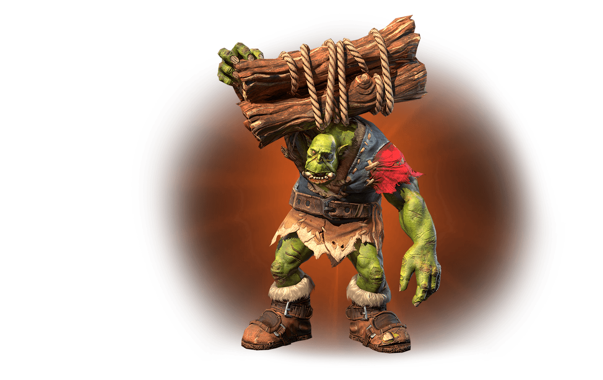

<div align="center">



# claude-code-sounds

**Sound themes for [Claude Code](https://docs.anthropic.com/en/docs/claude-code) lifecycle hooks.**

Plays sound effects when sessions start, prompts are submitted, responses finish, errors occur, and more.

Ships with 12 themes. Bring your own sounds or create new ones.

*"Something need doing?"*

</div>

## Quick Start

```bash
npx claude-code-sounds
```

The interactive installer checks dependencies, lets you pick a theme, and optionally customize which sounds map to each hook — all in the terminal.

Requires macOS (uses `afplay`) and Node.js 20+.

For scripted or CI usage, skip all prompts with `--yes`:

```bash
npx claude-code-sounds --yes
```

<details>
<summary>Alternative: install from source</summary>

```bash
git clone https://github.com/ryparker/claude-code-sounds.git
cd claude-code-sounds
./install.sh
```

The bash installer requires `jq` (`brew install jq`).

</details>

## Usage

```bash
npx claude-code-sounds              # Interactive install
npx claude-code-sounds --yes        # Install defaults, skip all prompts
npx claude-code-sounds --list       # List available themes
npx claude-code-sounds --uninstall  # Remove all sounds and hooks
npx claude-code-sounds --help       # Show help
```

## Themes

| Theme | Sounds | Vibe |
|---|---|---|
| **WC3 Orc Peon** (`wc3-peon`) | 57 | *"Something need doing?"* — Peons, Grunts, Shamans, and Grom Hellscream |
| **Zelda: Ocarina of Time** (`zelda-oot`) | 47 | *"Hey! Listen!"* — Navi, Link, and iconic OOT jingles |
| **Super Mario Bros** (`mario`) | 47 | *"Let's-a go!"* — Coins, power-ups, and Mario's voice from NES to N64 |
| **Star Wars** (`star-wars`) | 36 | *"May the Force be with you"* — Lightsabers, R2-D2, and the dark side |
| **Metal Gear Solid** (`mgs`) | 40 | *"Kept you waiting, huh?"* — Codec calls, alert sounds, and Snake |
| **Pokemon Gen 1** (`pokemon-gen1`) | 49 | *"Wild PIKACHU appeared!"* — Cries, battle sounds, and Kanto menus |
| **Portal** (`portal`) | 42 | *"Are you still there?"* — Turrets, portal guns, and Aperture Science |
| **Command & Conquer** (`cnc`) | 72 | *"Construction complete"* — EVA announcements, unit voices, and Red Alert |
| **Age of Empires 2** (`aoe2`) | 39 | *"Wololo!"* — Villager taunts, monks, and age advance fanfares |
| **Diablo 2** (`diablo2`) | 43 | *"Stay awhile and listen"* — Deckard Cain, item drops, and the Prime Evils |
| **Warhammer 40k** (`wh40k`) | 51 | *"For the Emperor!"* — Space Marines, Chaos war cries, and Ork shouts |
| **StarCraft** (`starcraft`) | 67 | *"Not enough minerals"* — Terran, Protoss, and Zerg voice lines |

Each theme maps sounds across all 11 Claude Code lifecycle events. Preview installed sounds with `./preview.sh`.

## Hook Events

| Event | Hook | When |
|---|---|---|
| `start` | `SessionStart` | Session begins |
| `end` | `SessionEnd` | Session ends |
| `prompt` | `UserPromptSubmit` | You submit a prompt |
| `stop` | `Stop` | Claude finishes responding |
| `permission` | `Notification` | Permission prompt appears |
| `idle` | `Notification` | Waiting for your input |
| `subagent` | `SubagentStart` | Subagent spawned |
| `error` | `PostToolUseFailure` | Tool call failed |
| `task-completed` | `TaskCompleted` | Task marked done |
| `compact` | `PreCompact` | Context compaction |
| `teammate-idle` | `TeammateIdle` | Teammate went idle |

## Creating a Theme

Themes live in `themes/<name>/` with two items:

### `theme.json`

Defines metadata and maps sound files to hook categories:

```json
{
  "name": "My Theme",
  "description": "A short description",
  "sounds": {
    "start": {
      "description": "Session starting",
      "files": [
        { "name": "descriptive-name.wav" }
      ]
    }
  }
}
```

### `sounds/`

Place audio files (`.wav` or `.mp3`) in `themes/<name>/sounds/` with filenames matching the `name` field in `theme.json`.

## How It Works

A single script (`~/.claude/hooks/play-sound.sh`) handles all events. It takes a category name as an argument, picks a random `.wav` or `.mp3` from `~/.claude/sounds/<category>/`, and plays it with `afplay`.

Hooks are configured in `~/.claude/settings.json` — each Claude Code lifecycle event calls the script with the appropriate category.

## Customizing

Drop any `.wav` or `.mp3` into the sound directories to add your own clips:

```
~/.claude/sounds/
├── start/        # add files here for session start
├── stop/         # add files here for response complete
├── error/        # add files here for failures
└── ...
```

The script picks randomly from whatever files are in each directory.

## Uninstalling

```bash
npx claude-code-sounds --uninstall
```

This removes all sound files, the hook script, and the hooks config from `settings.json`.

## Disclaimer

All game audio is property of its respective owners: Blizzard Entertainment (Warcraft, StarCraft, Diablo), Nintendo (Zelda, Mario, Pokemon), Lucasfilm/Disney (Star Wars), Konami (Metal Gear Solid), Valve (Portal), Electronic Arts/Westwood Studios (Command & Conquer), Xbox Game Studios/Ensemble Studios (Age of Empires), and Games Workshop/Relic Entertainment (Warhammer 40,000).
